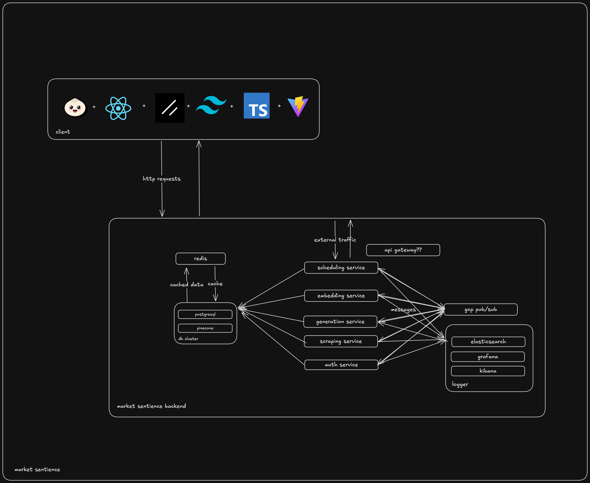

# Marketing Sentience

## Introduction

Market Sentience is a sentiment analysis platform powered by real-time data collection and a microservices architecture.

It leverages a CNN-LSTM deep learning model to analyze market sentiment from scraped data. The system orchestrates asynchronous tasks through a scheduler service and RabbitMQ, with dedicated services for scraping, embedding, and generation.

MongoDB stores conversation and message data, while Pinecone manages semantic embeddings for efficient retrieval. The generation service uses LLM-powered reasoning to produce actionable insights, delivered back to the client in real time.

## Index

- [Tech Stack](#tech-stack)
- [Setup](#setup)
- [System Design](#system-design)
- [Code Gen](#code-generation)

## Tech Stack

- Frontend
  - Vite
  - React
  - Shadcn
  - Vercel

- Backend
  - Node
  - Typescript
  - Express
  - PostgreSQL
  - Python
  - FastAPI
  - Pinecone
  - LangChain
  - MongoDB
  - GCP Pub/Sub
  - Puppeteer
  - Docker
  - SQLAlchemy

## Setup

- Add .env variables according to .env.example files

  #### Using start script

  ```bash
  chmod +x start.sh && ./start.sh
  ```

  #### Using Docker

  ```bash
  docker compose up
  ```

## System Design



## Code Generation

- Client code generation is employed in this project using OpenAPI for certain services
  that are used across multiple microservices to maintain consistency in behaviour and make
  sure changes in one service don't break in prod but even before commit.
