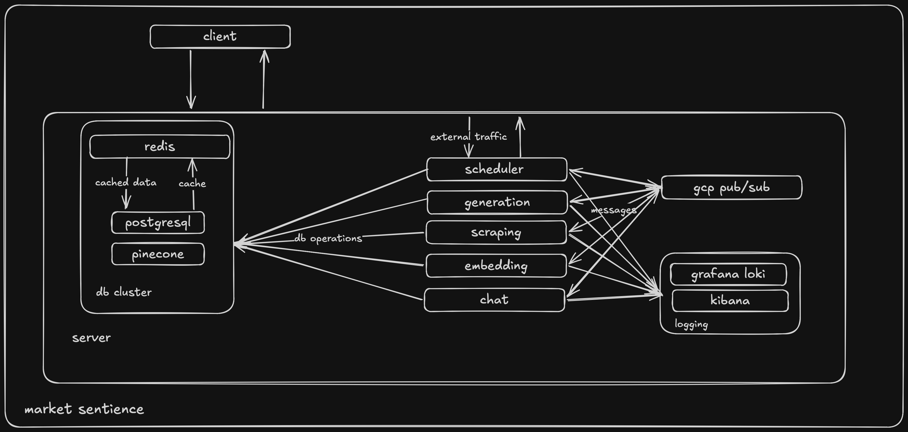

# Marketing Sentience

## Introduction

Market Sentience is a sentiment analysis platform powered by real-time data collection and a microservices architecture.

It leverages a CNN-LSTM deep learning model to analyze market sentiment from scraped data. The system orchestrates asynchronous tasks through a scheduler service and GCP Pub/Sub, with dedicated services for scraping, embedding, and generation.

PostgreSQL stores conversation and message data, while Pinecone manages semantic embeddings for efficient retrieval. The generation service uses the custom CNN-LSTM model to categorize reviews based on perceived sentiment and LLM-powered reasoning to produce actionable insights, delivered back to the client in real time.

The system also provides users a PDF compiled with the information from the generation service including charts, strategies and the ability to converse with an AI chat assistant to explore the data and answer any questions they may have.

## Index

- [Tech Stack](#tech-stack)
- [Setup](#setup)
- [System Design](#system-design)

## Tech Stack

- Frontend
  - Vite
  - React
  - Shadcn
  - Vercel

- Backend
  - Node
  - Typescript
  - Express
  - PostgreSQL
  - Python
  - FastAPI
  - Pinecone
  - LangChain
  - GCP Pub/Sub
  - Puppeteer
  - Docker
  - SQLAlchemy

## Setup

- Add .env variables according to .env.example files

  #### Using start script

  ```bash
  chmod +x run.sh && ./run.sh
  ```

  #### Using Docker

  ```bash
  docker compose up
  ```

## System Design


